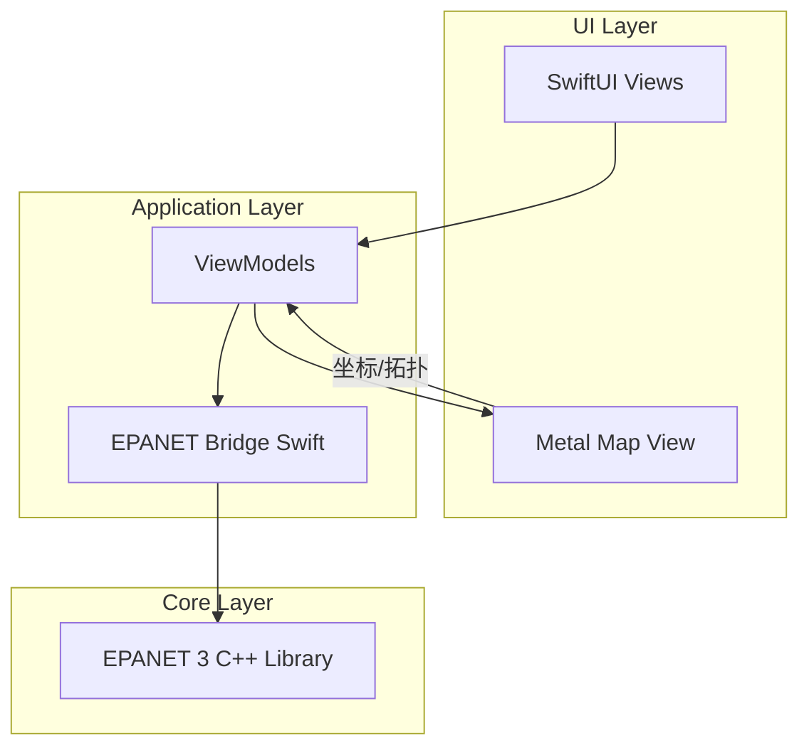

# EPANET 3.0 macOS/iOS 移植与 GUI 项目规划

## 一、项目目标与约束


| 维度     | 目标                      |
| ------ | ----------------------- |
| 平台     | macOS + iOS             |
| 数据格式   | **仅 .inp（文本）**，不支持 .net |
| 规模     | 10 万节点 + 10 万管段流畅运行     |
| 加载+渲染  | ≤ 5 秒                   |
| 单次平差计算 | ≤ 5 秒                   |

**格式说明**：已取消对 .net 格式的支持，仅支持 .inp 文本格式。

---

## 二、工作根目录与资源

**工作根目录**：`xcode-cursor`（即本仓库根目录）。

### 2.1 源码与算例位置（`epanet  resource/`）


| 内容            | 路径                                       | 说明                                  |
| ------------- | ---------------------------------------- | ----------------------------------- |
| EPANET 3.0 源码 | `epanet  resource/epanet-dev-develop/` | C++/CMake，用于引擎移植与 Swift 桥接 |
| EPANET 2.2 源码 | `epanet  resource/EPANET2.2-2.2.0/` | 参考 GUI 与行为；本产品不支持 .net 格式 |
| 标准算例（可打开与计算） | `epanet  resource/example/Epanet 管网/` | **net1.inp**、**any1.inp**，用于功能与回归测试 |
| 可计算大算例（程序生成） | `epanet  resource/example/可计算 算例管网 inp/` | 节点数约 **400～490000**，用于性能与规模验证 |
| 不可计算大算例（仅显示） | `epanet  resource/example/不可计算 算例管网 inp/` | 节点数约 **400～1000000**，用于载入与渲染压力测试 |


**可计算算例**：400.inp、10000.inp、90000.inp、490000.inp 等（需能跑通平差）。  
**不可计算算例**：400.inp、2500.inp、6400.inp、10000.inp、20000.inp、90000.inp、160000.inp、250000.inp、490000.inp、1000000.inp（用于验证大图载入与显示，不要求收敛）。

### 2.2 规划文档位置

- 本规划：`.cursor/plans/epanet_3_macos_ios_移植规划_0481b163.plan.md`（可复制到 `xcode-cursor/docs/` 等便于版本管理）。

---

## 三、现状分析

### 3.1 EPANET 3 源码结构（`epanet  resource/epanet-dev-develop/`）

- **语言/构建**：C++11，CMake，无 Xcode 集成
- **输入格式**：仅支持 `.inp` 文本格式，**不支持 .net 二进制**
- **API**：`[src/epanet3.h](epanet%20%20resource/epanet-dev-develop/src/epanet3.h)` 提供 C API：`EN_loadProject`、`EN_runSolver`、`EN_getNodeValue`、`EN_getLinkValue` 等
- **图形数据**：节点含 `xCoord`、`yCoord`，管段通过 `getLinkNodes` 获取起止节点
- **求解器**：GGA + Sparspak 稀疏矩阵，适配大管网

### 3.2 EPANET 2.2 GUI 功能对标

- 网络地图、节点/管段/水池/水泵/阀门显示
- 属性面板、缩放/平移、全图显示、查询
- 参数着色（压力、流量等）
- 运行计算、报告输出

---

## 四、技术路线

### 4.1 整体架构




### 4.2 核心技术选型


| 模块    | 技术选择                                 | 理由                                 |
| ----- | ------------------------------------ | ---------------------------------- |
| 引擎集成  | 将 EPANET 3 编译为 **静态库 / XCFramework** | 保持 C++ 实现，Swift 通过 C 接口调用          |
| 图形渲染  | **Metal** 批量绘制线段与点                   | 10 万级元素需 GPU 批量渲染，SwiftUI 单元素渲染不适用 |
| UI 框架 | **SwiftUI**（辅以 AppKit/UIKit）         | 跨平台、易维护                            |
| 输入格式  | **仅 .inp**                           | 已取消对 .net 的支持，仅支持 .inp，简化实现并降低维护成本 |


### 4.3 开发顺序：macOS 优先

**先 macOS，后 iOS** 的策略：

- **阶段 1–4**：在 macOS 上完成引擎移植、Metal 渲染、完整 GUI、性能优化
- **阶段 5**：在已验证的共享核心基础上，新增 iOS Target，适配触控、布局与设备限制
- **共享层**：EPANET 3 引擎、Swift 桥接、Metal 渲染管线、数据模型 100% 共享
- **平台差异**：仅 UI Shell（菜单/工具栏/手势）、内存策略、设备能力检测需分别处理

理由：macOS 调试方便、内存限制宽松、可先用大屏验证 10 万规模；再在 iOS 上做能力分级与降级策略。

---

## 五、10 万级载入、渲染与内存方案

### 5.1 内存占用估算


| 数据                     | 10 万节点    | 10 万管段    | 合计              |
| ---------------------- | --------- | --------- | --------------- |
| Metal 顶点缓冲（xy + color） | ~1.6 MB   | ~3.2 MB   | ~5 MB           |
| EPANET 3 Network（C++）  | ~20–40 MB | ~30–60 MB | ~50–100 MB      |
| Swift 模型/缓存            | ~10–20 MB | ~10–20 MB | ~20–40 MB       |
| 水力求解中间变量               | —         | —         | ~20–50 MB       |
| **粗估总量**               |           |           | **~100–200 MB** |


### 5.2 载入与渲染效率策略

- **解析**：后台线程解析 .inp，主线程仅接收解析完成事件
- **流式构建**：边解析边构建节点/管段列表，避免整文件读入后再批量处理
- **渲染数据**：解析完成后一次性生成 Metal 顶点缓冲（`MTLBuffer`），零拷贝或单次拷贝
- **视口裁剪**：仅将可见范围内节点/管段提交 GPU，或全量提交但用 `scissorRect` 限制（10 万线段单 draw call 已可行）
- **LOD**：视 zoom 级别决定显示密度（如 >5 万可见时，远处合并为简化线段）

### 5.3 内存管理方案

- **单一数据源**：EPANET 3 `EN_Project` 为权威数据源，Swift 层仅保留渲染用精简结构（坐标、ID、类型），避免完整对象副本
- **延迟加载**：属性面板按需从 C API 读取，不预缓存全部属性
- **结果缓存**：平差结果按时间步缓存于 C++ 侧，Swift 仅按需取数用于着色
- **大对象释放**：切换/关闭项目时显式 `EN_clearProject` 并释放 Metal 缓冲，避免持有大块内存

---

## 六、iOS 设备能力评估

### 6.1 内存限制（Jetsam）


| 设备 RAM | 典型设备            | 应用可用上限（约）  |
| ------ | --------------- | ---------- |
| 1 GB   | iPhone 6 等      | ~650 MB    |
| 2 GB   | iPhone 8        | ~1.4 GB    |
| 3 GB   | iPhone 7 Plus 等 | ~2 GB      |
| 4 GB+  | iPhone 12 及更新   | ~2.5–3 GB+ |


10 万级管网粗估需 **100–200 MB**，在 2 GB 及以上设备上理论可行；1 GB 设备存在被 Jetsam 终止的风险。

### 6.2 Metal 与 GPU

- **Buffer 限制**：`maxBufferLength` 在 iPhone 6 约 256 MB，iPhone 8 约 747 MB，新款设备 960 MB+；10 万顶点/线段所需 ~5–10 MB 远低于限制
- **绘制能力**：Metal 支持单 draw call 绘制数万至数十万图元，100k 线段/点属可接受范围
- **纹理**：若不做贴图，仅几何渲染，无纹理尺寸限制问题

### 6.3 结论与建议


| 项目      | 评估                          |
| ------- | --------------------------- |
| 10 万级渲染 | 可行，Metal 单批次绘制即可            |
| 10 万级载入 | 可行，需异步解析与精简内存结构             |
| 10 万级平差 | 依赖 CPU 与求解器，需在目标机型实测        |
| 内存      | 2 GB+ 设备可行；1 GB 设备建议限制规模或降级 |


**建议**：

1. **能力分级**：检测 `ProcessInfo.processInfo.physicalMemory` 或类似指标，在低内存设备上提示「建议管网规模 < 5 万」或限制载入
2. **实测基准**：在 iPhone 12/13/14、iPad Pro 等代表机型上，实测 10 万规模载入、渲染、平差耗时与内存峰值
3. **降级策略**：低端设备可提供「简化显示」（如仅显示管段、节点用采样）或限制最大载入规模
4. **最低支持**：明确最低支持机型（如 iPhone 8 / iOS 14），并在文档中说明 10 万规模推荐配置

---

## 七、环境检查与还需要的资料

### 7.1 环境检查清单


| 项目                       | 用途                | 检查方式                            |
| ------------------------ | ----------------- | ------------------------------- |
| Xcode（含 macOS / iOS SDK） | 构建 App、调试         | `xcodebuild -version`           |
| Swift 5+                 | 应用层与桥接            | 随 Xcode 提供                      |
| CMake 3.x（可选）            | 单独构建 EPANET 3 命令行 | `cmake --version`               |
| macOS 13+ / iOS 16+（建议）  | 目标系统              | 按需在 Xcode 中设置 deployment target |
| 物理内存 ≥ 8 GB              | 开发与 10 万级调试       | 系统信息                            |


**建议**：在 `xcode-cursor` 根目录下运行一次 EPANET 3 的 CMake 构建（若存在 `epanet  resource/epanet-dev-develop/CMakeLists.txt`），确认能生成 `run-epanet3` 并用 `net1.inp` / `any1.inp` 跑通，作为引擎基准。

### 7.2 还需要的资料


| 类型                  | 说明                                    | 备注                                   |
| ------------------- | ------------------------------------- | ------------------------------------ |
| EPANET 3 C API 完整说明 | `EN_`* 参数含义、返回值、线程安全                  | 可结合 `epanet3.h` 与源码注释自行整理            |
| .inp 段与字段说明         | 各 [SECTION] 的列含义、单位                   | EPANET 2.2 User Manual 或 EPANET 3 文档 |
| 10 万级算例的节点/管段数说明    | 可计算 400～490000、不可计算 400～1000000 的精确规模 | 若有 README 或命名规则可写入规划                 |
| EPANET 2.2 GUI 操作清单 | 需对齐的菜单、工具栏、地图交互                       | 参考 `EPANET2.2-2.2.0` 与官方文档           |
| 大算例生成方式             | 可计算/不可计算 inp 的生成程序或脚本                 | 便于回归与性能复现                            |


若后续有官方 EPANET 3 开发者文档、二进制格式说明或测试规范，可补充到本小节。

**环境检查结果**：当前工作区已具备 EPANET 3 的 `CMakeLists.txt`；若本机未安装 CMake，可用 Xcode 直接加入 C++ 源码构建，无需依赖 CMake。建议安装 CMake（如 `brew install cmake`）以便在集成前独立验证 `run-epanet3` 与 net1.inp/any1.inp。

---

## 八、实施方案

### 阶段一：引擎移植与构建集成（约 2–3 周）

1. **Xcode 集成 EPANET 3**
  - 新建 Xcode 工程或使用 CMake 生成 Xcode 项目
  - 配置 macOS / iOS 目标，处理 C++ 编译选项与架构（arm64/x86_64）
  - 编译为 `libepanet3.a` 或 XCFramework
2. **Swift 桥接层**
  - 用 `@_implementationOnly import` 或模块映射封装 C API
  - 封装 `EN_Project`、`EN_loadProject`、`EN_runSolver`、`EN_getNodeValue`、`EN_getLinkValue` 等
  - 暴露 `Node`、`Link`、`Pump`、`Valve`、`Tank`、`Reservoir` 等 Swift 模型
3. **基础功能验证**
  - 加载示例 .inp，运行一次平差，校验与官方 CLI 输出一致

### 阶段二：图形引擎与地图视图（约 3–4 周）

1. **Metal 渲染管线**
  - 使用 `MTKView` 或 SwiftUI 中嵌入 Metal 视图
  - 管线：线段批次（管段）、点批次（节点），支持缩放、平移、视口裁剪
  - 为 10 万级元素设计：单一 draw call 绘制全部线段，单一 draw call 绘制全部节点
2. **场景与坐标**
  - 从 EPANET 3 拉取 `nodes`、`links`，构建 `SceneGraph` 或等效结构
  - 支持无坐标网络：自动布局（力导向或网格）作为备选
  - 坐标单位转换与地图范围计算
3. **交互**
  - 双指/滚轮缩放、拖拽平移
  - 点击选中节点/管段，高亮并显示属性面板
  - 全图显示、按元素 ID 查找并定位

### 阶段三：GUI 完整功能（约 2–3 周）

1. **属性面板**
  - 节点：高程、需水量、压力、水头等
  - 管段：管径、长度、粗糙度、流量、流速等
  - 水池、水泵、阀门等专用属性
  - 支持只读展示 + 后续扩展编辑（需 EPANET 3 的 setter API）
2. **运行与结果**
  - “运行计算” 按钮，后台调用 `EN_runSolver` / 完整水力模拟
    - 进度反馈、错误信息展示
    - 结果映射到地图着色（压力、流量等）
    - 简单报告导出（文本或 CSV）
3. **EPANET 2.2 功能对齐**
  - 图例、颜色映射、可选背景图
    - 与 EPANET 2.2 操作习惯尽量一致

### 阶段四：性能优化与 macOS 验证（约 2 周）

1. **加载性能**
  - 解析与渲染分离、流水线化
  - 目标：10 万节点+管段，加载+首次渲染 ≤ 5 秒
2. **计算性能**
  - 在 macOS 上测试 10 万规模单次平差耗时
  - 若超 5 秒：评估稀疏求解器参数或算法优化

### 阶段五：iOS 移植与设备适配（约 1–2 周）

1. **新增 iOS Target**
  - 复用共享 Core、渲染、ViewModel
  - 适配触控手势、Split View、多任务
2. **能力检测与降级**
  - 根据物理内存提示推荐管网规模
  - 低端设备可限制最大载入或简化显示
3. **真机验证**
  - 在 iPhone 12+、iPad Pro 等设备上实测 10 万规模
  - 记录内存峰值与平差耗时

---

## 九、项目结构建议

```
EPANET3App/
├── EPANET3App.xcodeproj
├── EPANET3Core/           # EPANET 3 引擎封装
│   ├── EPANET3/           # C++ 源码（或链接预编译库）
│   └── EPANET3Bridge/     # Swift 桥接
├── EPANET3Parser/         # .inp 解析（引擎内置，不支持 .net）
├── EPANET3Renderer/       # Metal 渲染
├── EPANET3UI/             # SwiftUI 界面
│   ├── MapView/
│   ├── PropertyPanel/
│   └── Toolbar/
├── Shared/                # 共享模型与工具
└── Tests/
```

---

## 十、风险与对策


| 风险            | 对策                                      |
| ------------- | --------------------------------------- |
| 10 万规模平差超 5 秒 | 先实测 EPANET 3 现有求解器；必要时替换或优化稀疏求解器、减少迭代次数 |
| Metal 开发成本高   | 可用 Core Graphics 先实现基础版，再逐步迁移到 Metal    |
| iOS 内存限制      | 大管网采用分块加载、延迟解码、结果缓存                     |


---

## 十一、里程碑与时间估算


| 阶段     | 内容              | 预估时间        |
| ------ | --------------- | ----------- |
| 1      | 引擎移植 + Swift 桥接 | 2–3 周       |
| 2      | Metal 渲染与地图交互   | 3–4 周       |
| 3      | 完整 GUI 与计算流程    | 2–3 周       |
| 4      | 性能优化与 macOS 验证   | 2 周         |
| 5      | iOS 移植与设备适配     | 1–2 周       |
| **合计** |                 | **10–14 周** |


---

## 十二、建议的下一步

1. 使用现有 .inp 示例，在 macOS 上完成 EPANET 3 编译与 Swift 桥接，验证 API 可用性。
2. 搭建最小 Metal 视图，加载 1 万节点/管段，测量渲染帧率与内存，验证技术可行性。
3. 使用 10 万级测试管网，在目标设备上实测 EPANET 3 单次平差耗时，作为性能基准。
4. 在 iOS 真机上复测载入与平差，确定能力分级策略。（**已取消对 .net 的支持，仅支持 .inp。**）

